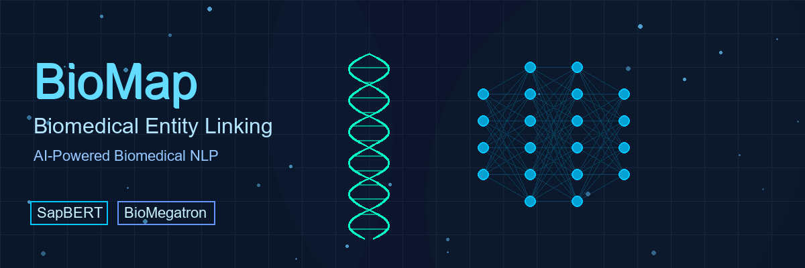

<p align="center">
  
</p>

# BioMap: Entity Linking Benchmark

A comprehensive benchmarking framework for biomedical entity linking using multiple state-of-the-art approaches including traditional embeddings, fine-tuned transformers, and large language models.

## Overview

This repository implements and compares four distinct entity linking approaches:

1. **SapBERT + FAISS** - Dense retrieval using biomedical embeddings
2. **BioMegatron** - Fine-tuned transformer classifier  
3. **GPT-4o** - Zero-shot large language model evaluation
4. **Gemini** - Zero-shot large language model evaluation

All methods are evaluated on the MedMentions ST21pv dataset with MONDO entity mappings, providing comprehensive Hits@K and MRR metrics.

## Environment Setup

We use conda for environment management to ensure reproducible dependencies and optimal GPU support.

### Prerequisites

- [Anaconda](https://www.anaconda.com/products/distribution) or [Miniconda](https://docs.conda.io/en/latest/miniconda.html)
- Python 3.8 or higher

### Installation

Choose the appropriate environment based on your system:

#### NVIDIA GPU (Linux/Windows with CUDA)
```bash
conda env create -f environments/environment.yaml
conda activate biomap-env
```

#### CPU-Only Systems
```bash
conda env create -f environments/environment-cpu.yaml
conda activate biomap-env
```

#### Mac (Apple Silicon Optimized)
```bash
conda env create -f environments/environment-mac.yaml
conda activate biomap-env
```

### Verification

Verify your installation:

```bash
# Check PyTorch
python -c "import torch; print(f'PyTorch version: {torch.__version__}')"

# Check GPU support
python -c "import torch; print(f'CUDA: {torch.cuda.is_available()}, MPS: {torch.backends.mps.is_available()}')"

# Check dependencies
python -c "import transformers, datasets, faiss; print('All dependencies loaded')"
```

## Key Features

### Comprehensive Evaluation Framework
- Multiple entity linking approaches in unified evaluation
- Standardized Hits@K and MRR metrics
- Parallel processing for efficient LLM evaluation
- Production-ready performance tracking

### Advanced Model Training
- Best model selection based on validation loss
- Comprehensive metrics tracking and visualization
- High-resolution plots and ROC curve analysis
- Professional-grade training pipeline
- Automatic checkpoint resumption for continued training

### Scalable LLM Integration
- Full candidate set evaluation (not limited sampling)
- Maximum CPU parallelization for speed
- Representative mention text for semantic matching
- Support for multiple LLM providers

## Quick Start

### 1. Prepare Data
```bash
# Download MedMentions corpus
git clone https://github.com/chanzuckerberg/MedMentions.git medmentions

# Prepare the dataset
python prepare_dataset.py
```

### 2. Build Indices
```bash
# Build SapBERT FAISS index
python build_sapbert_index.py
```

### 3. Train Models
```bash
# Train BioMegatron classifier
python train_biomegatron_cls.py
```

**Checkpoint Resumption**: The training script automatically detects existing checkpoints and offers to resume training. This allows you to:
- Continue training from the last saved checkpoint
- Extend training with more epochs
- Resume interrupted training sessions

Example workflow:
```bash
# Initial training run
python train_biomegatron_cls.py  # Creates checkpoints

# Resume training (will ask for confirmation)
python train_biomegatron_cls.py  # Detects existing checkpoint at epoch N
# Output: "Resume training from checkpoint? (y/n)"

# To train longer, increase TARGET_EPOCHS in the script
```

### 4. Run Evaluation
```bash
# Evaluate all methods
python evaluate_all.py

# Evaluate specific methods
python evaluate_all.py --skip_gpt --skip_gemini

# Limited samples for testing
python evaluate_all.py --max_samples 10
```

## Architecture

### SapBERT + FAISS
- Uses pre-trained SapBERT biomedical embeddings
- FAISS index for efficient similarity search
- Representative mention text for entity descriptions

### BioMegatron Classifier
- Fine-tuned transformer-based binary classifier
- Optimized negative sampling strategy
- Best model selection via validation loss

### LLM Zero-Shot
- Semantic comparison using natural language
- Full candidate set evaluation for accuracy
- Parallel processing across all CPU cores
- Support for GPT-4o and Gemini models

## Results

The framework provides comprehensive evaluation metrics:

- **Hits@1, @3, @5, @10**: Top-k accuracy
- **MRR**: Mean Reciprocal Rank
- **Training metrics**: Loss curves, ROC analysis
- **Performance tracking**: JSON export for analysis

## Performance Optimization

### Parallel Processing
- Maximum CPU utilization for LLM evaluation
- Concurrent API calls within rate limits
- Efficient batch processing for transformers

### Memory Management
- Optimized batch sizes for GPU memory
- Streaming data processing for large datasets
- MPS support for Apple Silicon acceleration

### Production Features
- Comprehensive logging and progress tracking
- High-resolution visualization exports
- Structured metrics output (JSON)
- Best model checkpointing

## API Configuration

### OpenAI (GPT-4o)
Set up your API credentials as environment variables:
```bash
export OPENAI_API_KEY="your-openai-api-key"
export OPENAI_BASE_URL="your-base-url"  # Optional, defaults to https://api.openai.com/v1
```

### Google (Gemini)
Configure Gemini access:
```bash
export GOOGLE_API_KEY="your-google-api-key"
```

### Setting Environment Variables Permanently
Add to your shell configuration file (`~/.bashrc`, `~/.zshrc`, etc.):
```bash
echo 'export OPENAI_API_KEY="your-openai-api-key"' >> ~/.bashrc
echo 'export GOOGLE_API_KEY="your-google-api-key"' >> ~/.bashrc
source ~/.bashrc
```

## Command Line Options

### evaluate_all.py
```bash
--test              # Test file path (default: data/mondo_test.csv)
--models            # Models directory (default: models)
--output            # Output JSON file for results
--max_samples       # Limit test samples for debugging
--max_workers       # Parallel threads for LLM evaluation
--skip_sapbert      # Skip SapBERT evaluation
--skip_biomegatron  # Skip BioMegatron evaluation  
--skip_gpt          # Skip GPT-4o evaluation
--skip_gemini       # Skip Gemini evaluation
```

### train_biomegatron_cls.py
```bash
--num_train_epochs  # Training epochs (default: 10)
--batch_size        # Training batch size (default: 16)
--learning_rate     # Learning rate (default: 1e-5)
```

## Dataset: MedMentions ST21pv

High-quality biomedical entity linking dataset with UMLS/MONDO mappings.

### Statistics
- **Documents**: 4,392 PubMed abstracts
- **Entity types**: 21 biomedical semantic types
- **Format**: PubTator with UMLS concept identifiers
- **Mapping**: UMLS to MONDO ID conversion included

### Usage
The dataset is automatically processed by `prepare_dataset.py` which:
- Converts PubTator format to structured CSV
- Maps UMLS concepts to MONDO IDs
- Creates train/dev/test splits
- Generates representative mention mappings 

## Training Multiple Model Variants

The training script now supports multiple biomedical language models with different parameter sizes and automatic checkpoint resumption.

### Available Models

Use `--list_models` to see all available biomedical models:

```bash
python train_biomegatron_cls.py --list_models
```

**Currently Verified Models:**
- **BioMegatron 345M**: Original BioMegatron, pretrained on PubMed (345M parameters)
- **BioMistral 7B**: Large biomedical LLM based on Mistral (7B parameters) 
- **Clinical BERT**: Specialized for clinical notes (110M parameters)
- **PubMed BERT**: Trained on PubMed abstracts (110M parameters)
- **BioBERT**: Trained on PubMed and PMC articles (110M parameters)

**Note**: BioMegatron 800M and 1.2B variants exist in NVIDIA's research but are not publicly available on HuggingFace. For larger models, BioMistral-7B provides excellent performance and is readily available.

### Training Examples

#### Train BioMegatron 345M (original model)
```bash
python train_biomegatron_cls.py --model biomegatron-345m --epochs 10
```

#### Train BioMistral 7B (large biomedical model)
```bash
python train_biomegatron_cls.py --model biomistral-7b --epochs 5 --batch_size 8
```

#### Train Clinical BERT
```bash
python train_biomegatron_cls.py --model clinical-bert --epochs 15
```

#### Train with custom hyperparameters
```bash
python train_biomegatron_cls.py \
    --model pubmed-bert \
    --epochs 20 \
    --batch_size 32 \
    --learning_rate 3e-5 \
    --warmup_steps 500
```

### Model Directory Structure

Models are automatically organized by size and type:
```
models/
├── models_345m_biomegatron345muncased/
│   ├── checkpoints/
│   ├── final_model/
│   ├── metrics/
│   └── model_info.json
├── models_7b_biomistral_7b/
│   ├── checkpoints/
│   ├── final_model/
│   ├── metrics/
│   └── model_info.json
└── models_110m_bio_clinicalbert/
    ├── checkpoints/
    ├── final_model/
    ├── metrics/
    └── model_info.json
```

### Checkpoint Resumption

The script automatically detects existing checkpoints and offers to resume training:

```bash
# If you have a partially trained model, the script will ask:
# "Found checkpoint at epoch 5. Continue training to epoch 10? (y/n)"

# Continue training from where you left off
python train_biomegatron_cls.py --model biomegatron-345m --epochs 20
```

### Model Verification

The script includes built-in model verification:
- ✅ Verifies model availability on HuggingFace
- 📊 Displays actual parameter counts
- 🔍 Validates model compatibility

### Performance Comparison

Different models offer trade-offs between size, speed, and performance:

| Model | Parameters | Speed | Medical Performance | Best Use Case |
|-------|------------|-------|-------------------|---------------|
| BioBERT | 110M | Fast | Good | Quick experiments |
| Clinical BERT | 110M | Fast | Good | Clinical text |
| PubMed BERT | 110M | Fast | Good | Research papers |
| BioMegatron 345M | 345M | Medium | Better | Balanced performance |
| BioMistral 7B | 7B | Slow | Best | Maximum accuracy |

## Inference with Multiple Models

### List Available Trained Models

```bash
python inference_biomegatron.py --list-models
```

### Use Specific Model for Inference

```bash
# Use specific model
python inference_biomegatron.py --model models_345m_biomegatron345muncased

# Interactive mode
python inference_biomegatron.py --model models_7b_biomistral_7b --interactive

# Custom batch size
python inference_biomegatron.py --model models_110m_bio_clinicalbert --batch-size 128
```

### Evaluation with Multiple Models

```bash
# Evaluate specific biomedical model
python evaluate_all.py --biomedical_model models_345m_biomegatron345muncased

# Compare all models (will auto-select first available)
python evaluate_all.py

# Skip certain evaluations for faster testing
python evaluate_all.py --skip_gpt --skip_gemini --max_samples 100
```

## Model Comparison Results

When you run evaluation, results are automatically organized by model type and size:

```
COMPREHENSIVE EVALUATION RESULTS
================================================================================
Model                      Hits@1    Hits@3    Hits@5   Hits@10       MRR
--------------------------------------------------------------------------------
BioMegatron 345M (345M)    0.7234    0.8456    0.8876    0.9234    0.7891
BioMistral 7B (7b)         0.7456    0.8678    0.9012    0.9345    0.8012
Clinical BERT (110M)       0.6987    0.8234    0.8654    0.9012    0.7654
SapBERT + FAISS           0.6543    0.7891    0.8234    0.8765    0.7234
GPT-4o                    0.8123    0.9234    0.9456    0.9678    0.8567
================================================================================
```

### Benefits of Multi-Model Support

1. **Model Size Flexibility**: Choose models based on your computational resources
2. **Domain Specialization**: Different models excel in different medical subdomains  
3. **Checkpoint Management**: Resume training seamlessly with automatic organization
4. **Fair Comparison**: Standardized evaluation across all model types
5. **Production Ready**: Easy deployment with model auto-detection

### Recommended Model Selection

- **Small/Fast**: `clinical-bert` or `pubmed-bert` (110M parameters)
- **Balanced**: `biomegatron-345m` (345M parameters) 
- **High Performance**: `biomistral-7b` (7B parameters, requires more GPU memory)

Choose based on your accuracy requirements and computational constraints. 